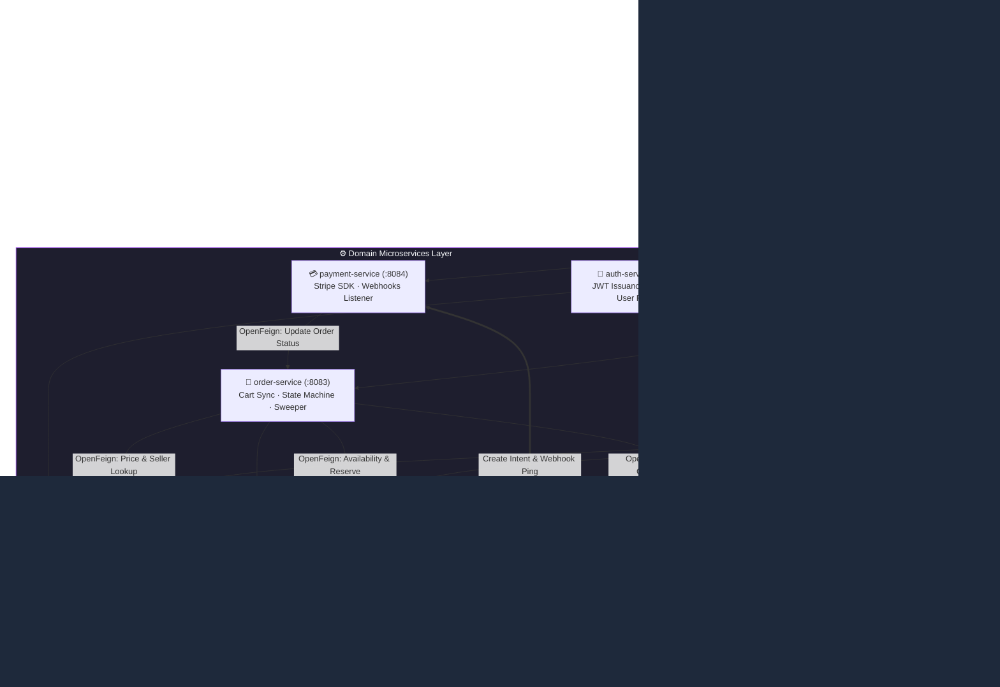
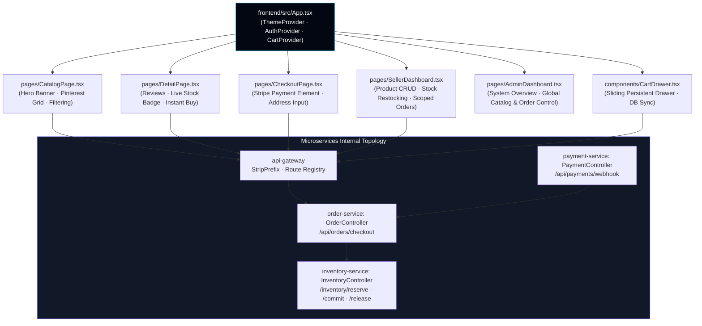
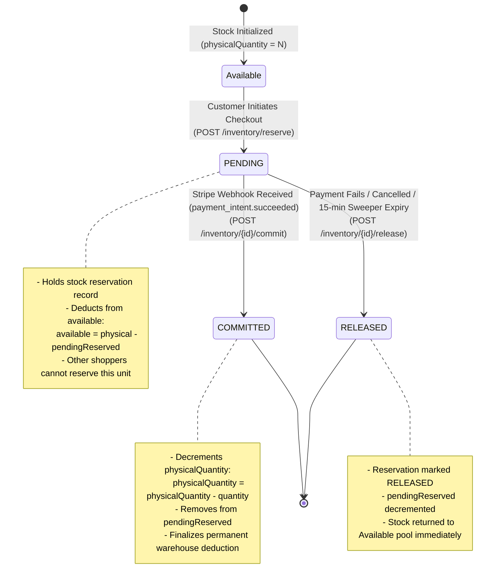
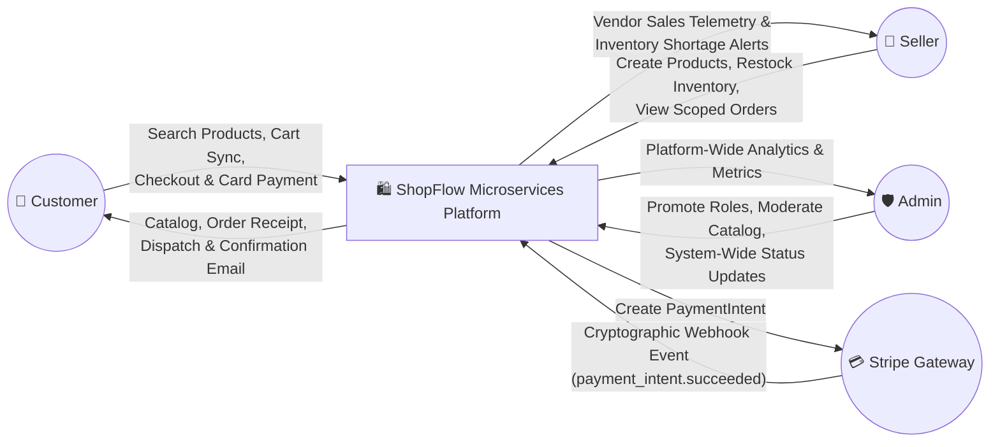
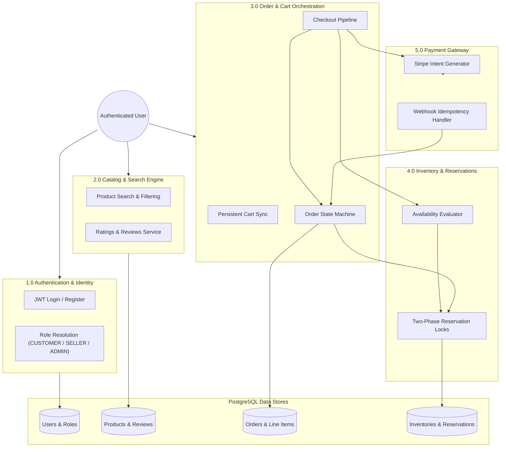
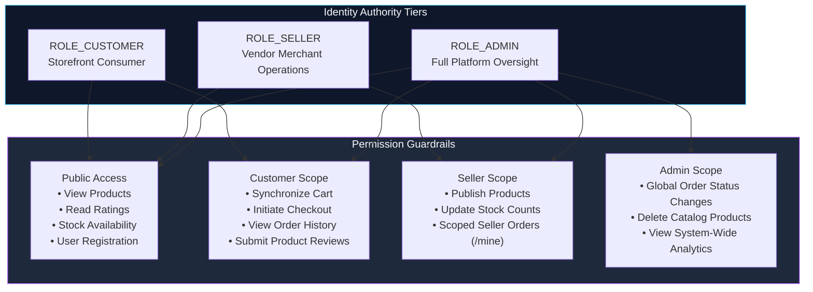

<div align="center">

# 🛍️ ShopFlow

### Production-grade multi-vendor e-commerce platform engineered with Java 17, Spring Boot 3.3.1 microservices, two-phase inventory reservation, Stripe payments, and a Vite + React glassmorphic frontend

[](https://www.oracle.com/java/)
[](https://spring.io/projects/spring-boot)
[](https://spring.io/projects/spring-cloud)
[](https://www.postgresql.org/)
[](https://react.dev/)
[](https://www.typescriptlang.org/)
[](https://vitejs.dev/)
[](https://stripe.com/)
[](https://www.docker.com/)
[](LICENSE)

</div>

---

## 📑 Table of Contents

- [Overview](#-overview)
- [Key Features](#-key-features)
- [System Architecture](#-system-architecture)
  - [High-Level Microservices Architecture](#high-level-microservices-architecture)
  - [Component Architecture](#component-architecture)
- [Two-Phase Inventory State Machine](#-two-phase-inventory-state-machine)
- [Data Flow Diagrams (DFDs)](#-data-flow-diagrams-dfds)
  - [DFD Level 0 — Context Diagram](#dfd-level-0--context-diagram)
  - [DFD Level 1 — Core Subsystems](#dfd-level-1--core-subsystems)
  - [DFD Level 2 — End-to-End Checkout & Payment Sequence](#dfd-level-2--end-to-end-checkout--payment-sequence)
- [Microservices Breakdown & Port Registry](#-microservices-breakdown--port-registry)
- [Multi-Vendor Marketplace Architecture](#-multi-vendor-marketplace-architecture)
- [Role-Based Access Control (RBAC)](#-role-based-access-control-rbac)
- [REST API Catalog](#-rest-api-catalog)
- [Tech Stack](#-tech-stack)
- [Getting Started](#-getting-started)
  - [Prerequisites](#prerequisites)
  - [1-Click Windows Setup Script](#1-click-windows-setup-script)
  - [Manual Build & Startup](#manual-build--startup)
  - [Environment Variables Configuration](#environment-variables-configuration)
- [Testing & Quality Assurance](#-testing--quality-assurance)
  - [Automated Backend Unit & Security Tests](#automated-backend-unit--security-tests)
  - [End-to-End Playwright Browser Suite](#end-to-end-playwright-browser-suite)
  - [Postman E2E Regression Collection](#postman-e2e-regression-collection)
- [License](#-license)

---

## 🌟 Overview

**ShopFlow** is an enterprise-grade, distributed multi-vendor e-commerce platform built to simulate high-throughput commerce workflows across independent, fault-tolerant microservices. 

It addresses common distributed commerce challenges: **overselling under concurrent checkouts**, **distributed transaction rollback**, **asynchronous payment confirmation**, **multi-vendor data isolation**, and **un-opinionated custom glassmorphic UX** without third-party styling framework lock-in.

### Core Capabilities at a Glance

- **Two-Phase Inventory Reservation**: Concurrency-safe reservation locks (`PENDING` $\rightarrow$ `COMMITTED` / `RELEASED`) prevent overselling when multiple shoppers purchase the last stock unit simultaneously.
- **Asynchronous Stripe Webhook Pipeline**: Idempotent webhook listener decouples payment authorization from synchronous user browser requests, ensuring guaranteed order fulfillment even on network drops.
- **Strict Multi-Vendor Scoping**: Complete catalog and order partitioning where sellers manage their independent product inventories and query seller-filtered fulfillment pipelines (`/api/orders/seller/mine`).
- **Distributed Service Mesh with Eureka & API Gateway**: Unified routing, dynamic client-side load balancing, JWT claims propagation, and OpenFeign inter-service communication.
- **Zero-Dependency Glassmorphic UI**: High-performance React 18 frontend written in pure Vanilla CSS design tokens with adaptive Light/Dark/System themes, drawer cart synchronization, and real-time inventory telemetry.

---

## 🚀 Key Features

### Distributed Transaction & Inventory Protection
| Capability | Description |
|---|---|
| **Optimistic Stock Locking** | Availability calculations (`physical - pendingReserved`) executed inside transactional scopes to guarantee accurate stock figures. |
| **Auto-Expiring Reservation Sweeper** | Background scheduled worker releases orphaned `PENDING` reservations if a customer abandons their Stripe payment session after 15 minutes. |
| **Atomic Compensating Rollbacks** | If checkout fails on line-item $N$ of a multi-product cart, all preceding reservations ($1 \dots N-1$) are automatically released via compensating Feign calls. |

### Payments & Asynchronous Event Processing
| Capability | Description |
|---|---|
| **Stripe Payment Element** | Secure credit card and digital wallet collection in the browser without exposing sensitive payment credentials to application servers. |
| **Webhook Signature Validation** | Cryptographic HMAC validation (`stripe.webhook.secret`) guarantees that state updates originate exclusively from genuine Stripe servers. |
| **Non-Blocking SMTP Mail Pipeline** | Order confirmation and tracking emails are dispatched asynchronously through `notification-service`, isolating SMTP latency from checkout speed. |

### Multi-Vendor Seller Operations
| Capability | Description |
|---|---|
| **Isolated Seller Catalog** | Sellers can create, update, restock, and delete their own products without accessing or mutating peer vendors' inventory. |
| **Order Item Snapshotting** | Every order item captures a historical snapshot of `sellerId` and `unitPrice` at the moment of checkout, maintaining revenue integrity over future price changes. |
| **Seller Analytics Dashboard** | Real-time calculation of revenue, orders placed, units sold, and stock depletion rates filtered strictly to the authenticated vendor. |

---

## 🏗️ System Architecture

### High-Level Microservices Architecture



---

### Component Architecture



---

## 🔒 Two-Phase Inventory State Machine

The inventory subsystem isolates stock tracking from order creation using a two-phase reservation pattern. This guarantees that stock is reserved immediately upon checkout initiation, but not permanently deducted until payment confirmation is verified via Stripe.



---

## 🔄 Data Flow Diagrams (DFDs)

### DFD Level 0 — Context Diagram



---

### DFD Level 1 — Core Subsystems



---

### DFD Level 2 — End-to-End Checkout & Payment Sequence

```mermaid
sequenceDiagram
    autonumber
    actor Customer as 👤 Customer Browser
    participant Gateway as 🚪 API Gateway (:8080)
    participant OrderSvc as 🛒 Order Service (:8083)
    participant ProductSvc as 📦 Product Service (:8082)
    participant InvSvc as 📊 Inventory Service (:8085)
    participant PaySvc as 💳 Payment Service (:8084)
    participant Stripe as 💳 Stripe API
    participant NotifSvc as ✉️ Notification Service (:8086)

    Customer->>Gateway: POST /api/orders/checkout (Bearer JWT + Cart Items)
    Gateway->>OrderSvc: Dispatches Request (UserId & Role in Context)
    
    loop For each Cart Line Item
        OrderSvc->>InvSvc: GET /inventory/{productId}/availability?quantity=N
        InvSvc-->>OrderSvc: 200 OK (isAvailable: true, availableStock: 45)
        
        OrderSvc->>InvSvc: POST /inventory/reserve ({orderId, productId, quantity})
        InvSvc-->>OrderSvc: 200 OK (reservationId: UUID, status: PENDING)

        OrderSvc->>ProductSvc: GET /products/{productId} (Fetch latest price & sellerId)
        ProductSvc-->>OrderSvc: 200 OK (price: 49.99, sellerId: UUID)
    end

    OrderSvc->>OrderSvc: Persist Order (Status: PENDING_PAYMENT, expiresAt: now + 15m)
    OrderSvc-->>Customer: 201 Created (Order Object with OrderId)

    Customer->>Gateway: POST /api/payments/create-intent ({orderId, amount})
    Gateway->>PaySvc: Dispatches Intent Creation
    PaySvc->>Stripe: stripe.paymentIntents.create({amount, currency: "usd"})
    Stripe-->>PaySvc: PaymentIntent {clientSecret: "pi_xxx_secret_xxx"}
    PaySvc-->>Customer: 200 OK {clientSecret}

    Customer->>Stripe: Confirm Card Payment via Stripe.js Element
    Stripe-->>Customer: Payment Authorization Confirmed

    Note over Stripe,PaySvc: Asynchronous Server-to-Server Webhook
    Stripe->>Gateway: POST /api/payments/webhook (Stripe-Signature header)
    Gateway->>PaySvc: Dispatches Webhook
    PaySvc->>PaySvc: Verify Cryptographic Webhook Signature
    
    alt Event: payment_intent.succeeded
        PaySvc->>OrderSvc: PUT /orders/{orderId}/status (newStatus: PAID)
        OrderSvc->>InvSvc: POST /inventory/{reservationId}/commit
        InvSvc->>InvSvc: physicalQuantity -= reservedQty; status = COMMITTED
        InvSvc-->>OrderSvc: 200 OK (Committed)
        
        OrderSvc->>NotifSvc: POST /notifications/order-confirmation
        NotifSvc->>Customer: Dispatches HTML Receipt via SMTP
    else Event: payment_intent.payment_failed
        PaySvc->>OrderSvc: PUT /orders/{orderId}/status (newStatus: FAILED)
        OrderSvc->>InvSvc: POST /inventory/{reservationId}/release
        InvSvc->>InvSvc: status = RELEASED (Available stock unblocked)
    end
```

---

## 🧩 Microservices Breakdown & Port Registry

ShopFlow is partitioned into **9 dedicated modules**:

| Service Module | Port | Technology Stack | Primary Responsibilities | Database Schema |
|---|:---:|---|---|---|
| **`eureka-server`** | `8761` | Spring Cloud Netflix Eureka | Heartbeat monitoring, service registration, dynamic discovery registry | In-Memory Registry |
| **`api-gateway`** | `8080` | Spring Cloud Gateway | Unified routing endpoint, StripPrefix routing, global CORS, and JWT forwarding | Stateless |
| **`auth-service`** | `8081` | Spring Boot 3 + Spring Security + JJWT | User registration, password hashing (BCrypt), JWT token generation, role assignments | `users` |
| **`product-service`** | `8082` | Spring Boot 3 + JPA + Hibernate | Product catalog, multi-vendor seller isolation, categories, customer reviews & star ratings | `products`, `reviews`, `promotions` |
| **`order-service`** | `8083` | Spring Boot 3 + OpenFeign | Shopping cart database sync, order placement state machine, 15-minute expiry sweeper | `orders`, `order_items`, `cart_items` |
| **`payment-service`** | `8084` | Spring Boot 3 + Stripe Java SDK | Stripe PaymentIntent generation, webhook HMAC signature verification, order status dispatch | Stateless Event Worker |
| **`inventory-service`** | `8085` | Spring Boot 3 + JPA + Spring Security | Two-phase reservation locks, stock availability computation, restock management | `inventories`, `reservations` |
| **`notification-service`**| `8086`| Spring Boot 3 + Spring Mail | Asynchronous order confirmation emails, HTML mail templating via SMTP | Stateless Mail Worker |
| **`common`** | — | Java 17 Shared Library | Shared DTOs (`AvailabilityResponse`, `ReserveRequest`) and OpenFeign client contracts | Shared Dependency |
| **`frontend`** | `5173` | Vite 5 + React 18 + TypeScript | Responsive glassmorphic shopping experience, seller dashboard, and admin operations | Browser LocalStorage |

---

## 🏢 Multi-Vendor Marketplace Architecture

ShopFlow implements native multi-tenancy for sellers:

1. **Vendor Isolation**: When a product is created, the system extracts the authenticated `userId` from the verified JWT and records it into `seller_id`.
2. **Restricted Catalog Mutation**: Only users possessing `ROLE_SELLER` matching the product's `sellerId` (or global `ROLE_ADMIN`) may modify price, details, or stock.
3. **Seller Order Scoping**: When customers place multi-item orders containing products from different sellers:
   - Every line item records an immutable snapshot of `sellerId`.
   - The endpoint `GET /api/orders/seller/mine` automatically queries the database using a custom projection that filters `order_items` belonging strictly to the requesting seller, preventing cross-vendor revenue leakage.

---

## 🛡️ Role-Based Access Control (RBAC)

The platform enforces three distinct user authority tiers:



---

## 📡 REST API Catalog

All requests flow through the API Gateway (`http://localhost:8080/api/*`):

### 1. Authentication Service (`/api/auth`)
| Method | Endpoint | Access | Payload / Query | Description |
|---|---|:---:|---|---|
| `POST` | `/api/auth/register` | Public | `{email, password, name}` | Creates user with default `CUSTOMER` role |
| `POST` | `/api/auth/login` | Public | `{email, password}` | Returns Bearer JWT token and user profile |
| `GET` | `/api/auth/me` | Authenticated | — | Returns current authenticated user profile |
| `PUT` | `/api/auth/profile/address` | Authenticated | `{address}` | Updates saved customer shipping address |

### 2. Product Service (`/api/products`)
| Method | Endpoint | Access | Payload / Query | Description |
|---|---|:---:|---|---|
| `GET` | `/api/products` | Public | `page, size, category, sortBy` | Paginated product listing |
| `GET` | `/api/products/{id}` | Public | — | Retrieves single product details |
| `POST` | `/api/products` | `SELLER`, `ADMIN` | `{name, price, category, imageUrl, description}` | Creates new catalog item tagged with seller ID |
| `PUT` | `/api/products/{id}` | `SELLER`, `ADMIN` | `{name, price, category, imageUrl, description}` | Updates existing product details |
| `DELETE`| `/api/products/{id}` | `SELLER`, `ADMIN` | — | Removes product from catalog |
| `GET` | `/api/products/{id}/reviews` | Public | `page, size` | Retrieves paginated customer reviews |
| `POST` | `/api/products/{id}/reviews` | `CUSTOMER` | `{rating, comment}` | Submits review with star rating (1–5) |
| `GET` | `/api/products/mine` | `SELLER` | — | Retrieves all products published by caller |

### 3. Order Service (`/api/orders`)
| Method | Endpoint | Access | Payload / Query | Description |
|---|---|:---:|---|---|
| `GET` | `/api/orders/cart` | Authenticated | — | Returns persistent database shopping cart |
| `POST` | `/api/orders/cart` | Authenticated | `{productId, quantity}` | Synchronizes cart items to database |
| `DELETE`| `/api/orders/cart/{productId}`| Authenticated| — | Removes specific product from cart |
| `DELETE`| `/api/orders/cart` | Authenticated | — | Clears all cart items |
| `POST` | `/api/orders/checkout` | `CUSTOMER`, `ADMIN` | `{userId, shippingAddress, items: [...]}` | Triggers reservation, price lookup & order placement |
| `GET` | `/api/orders/{id}` | Authenticated | — | Fetches order summary by UUID |
| `GET` | `/api/orders/history` | Authenticated | — | Retrieves customer purchase history |
| `GET` | `/api/orders/seller/mine` | `SELLER` | — | Scoped vendor orders filtered by seller item |
| `PUT` | `/api/orders/{id}/status` | Internal / Admin | `newStatus` | Transitions order state machine |

### 4. Inventory Service (`/api/inventory`)
| Method | Endpoint | Access | Payload / Query | Description |
|---|---|:---:|---|---|
| `GET` | `/api/inventory/{productId}/availability` | Public | `quantity` | Calculates available stock (`physical - pendingReserved`) |
| `GET` | `/api/inventory/{productId}` | Public | — | Returns physical, reserved, and available counts |
| `PUT` | `/api/inventory/{productId}` | `SELLER`, `ADMIN` | `{quantity}` | Restocks physical warehouse inventory |
| `POST` | `/api/inventory/reserve` | Internal / Order | `{orderId, productId, quantity}` | Locks stock under `PENDING` reservation |
| `POST` | `/api/inventory/{id}/commit` | Internal / Order | — | Decrements physical stock & marks `COMMITTED` |
| `POST` | `/api/inventory/{id}/release` | Internal / Order | — | Frees pending reservation & marks `RELEASED` |
| `GET` | `/api/inventory/order/{orderId}` | Authenticated | — | Retrieves all reservations associated with an order |

### 5. Payment Service (`/api/payments`)
| Method | Endpoint | Access | Payload / Query | Description |
|---|---|:---:|---|---|
| `POST` | `/api/payments/create-intent` | `CUSTOMER` | `{orderId, amount, email}` | Creates Stripe PaymentIntent and returns clientSecret |
| `POST` | `/api/payments/webhook` | Stripe Webhook | Raw payload + `Stripe-Signature` | Validates HMAC signature & dispatches order updates |

---

## 💻 Tech Stack

```
ShopFlow Platform
├── Backend
│   ├── Language: Java 17 LTS (Adoptium Temurin)
│   ├── Framework: Spring Boot 3.3.1
│   ├── Cloud: Spring Cloud 2023.0.2 (Eureka, Gateway, OpenFeign)
│   ├── Security: Spring Security 6 + JJWT 0.12.5 (Stateless Bearer JWT)
│   ├── Persistence: Spring Data JPA + Hibernate ORM
│   ├── Database: PostgreSQL 16
│   └── Payments: Stripe Java SDK v24+
│
├── Frontend
│   ├── Runtime: Node.js LTS (v20+ / v24+)
│   ├── Framework: Vite 5 + React 18 + TypeScript 5
│   ├── Styling: Pure Vanilla CSS (Glassmorphism design system tokens)
│   ├── Animation: Framer Motion
│   ├── Icons: Lucide React
│   └── Payments: @stripe/stripe-js + @stripe/react-stripe-js
│
└── Tooling & Testing
    ├── Build Tool: Apache Maven 3.9.6
    ├── End-to-End: Playwright Chromium Suite
    ├── API Testing: Postman Collection v2.1
    └── Architecture Knowledge Graph: Graphify AST Engine
```

---

## 🏁 Getting Started

### Prerequisites

Ensure you have the following installed on your local development machine:
- **Java JDK 17+** (`java -version`)
- **Node.js LTS v18+ or v20+** (`node -v`)
- **Apache Maven 3.9+** (`mvn -version`)
- **PostgreSQL 15+** (Local or cloud instance like Supabase / Neon)

---

### 1-Click Windows Setup Script

If setting up on a fresh Windows machine, run PowerShell as Administrator from the project root:

```powershell
Set-ExecutionPolicy Bypass -Scope Process -Force
.\setup_new_pc.ps1
```

This automated script installs Git, Node.js, JDK 17, Apache Maven, and configures all system `PATH` and `JAVA_HOME` environment variables automatically.

---

### Manual Build & Startup

#### 1. Compile & Package All Microservices
From the project root directory (`P:\ShopFlow`):

```powershell
# Build shared common library and backend microservices
.\.maven\apache-maven-3.9.6\bin\mvn.cmd clean package -DskipTests
```

#### 2. Install & Build Frontend
```powershell
cd frontend
npm install
npm run build
cd ..
```

#### 3. One-Click Platform Launch
Launch Eureka Server, Gateway, 6 Backend Microservices, and the Frontend development server in separate console sessions:

```powershell
.\start_services.ps1
```

Access the platform at:
- **Frontend Web Application**: `http://localhost:5173`
- **Spring Cloud Gateway**: `http://localhost:8080`
- **Eureka Service Discovery Dashboard**: `http://localhost:8761`

---

### Environment Variables Configuration

All microservices come with sensible local development defaults, but can be overridden via environment variables:

```bash
# Database Configuration
export DB_URL="jdbc:postgresql://localhost:5432/shopflow"
export DB_USERNAME="postgres"
export DB_PASSWORD="your_postgres_password"

# JWT Security
export JWT_SECRET="ShopFlowDefaultJwtSecretKeyForDev2026Base64StringLengthMinimum256Bits!"

# Stripe Integration
export STRIPE_SECRET_KEY="sk_test_51Pxxxxxxxxxxxxxxxxxxxx"
export STRIPE_WEBHOOK_SECRET="whsec_xxxxxxxxxxxxxxxxxxxxxx"

# SMTP Mail Delivery
export MAIL_HOST="sandbox.smtp.mailtrap.io"
export MAIL_PORT="2525"
export MAIL_USERNAME="your_mailtrap_username"
export MAIL_PASSWORD="your_mailtrap_password"
```

---

## 🧪 Testing & Quality Assurance

### Automated Backend Unit & Security Tests
To execute all unit tests, mock MVC tests, and Spring Security rule verifications across the platform:

```powershell
.\.maven\apache-maven-3.9.6\bin\mvn.cmd test
```

To run test suites for a specific service (e.g., `inventory-service`):
```powershell
.\.maven\apache-maven-3.9.6\bin\mvn.cmd test -pl inventory-service
```

### End-to-End Playwright Browser Suite
A Playwright test suite verifies UI flows including theme toggling, catalog browsing, and cart operations:

```powershell
cd frontend/Playwright
npm install
npx playwright test
```

### Postman E2E Regression Collection
A comprehensive Postman test suite ([`ShopFlow_E2E_Tests.postman_collection.json`](ShopFlow_E2E_Tests.postman_collection.json)) is provided in the repository root:
1. Import `ShopFlow_E2E_Tests.postman_collection.json` into Postman.
2. Set the collection variable `baseUrl` to `http://localhost:8080`.
3. Run the collection to validate authentication, multi-vendor product CRUD, checkout, and inventory decrement flows.

---

## 📄 License

This project is licensed under the **MIT License** — see the [LICENSE](LICENSE) file for details.
