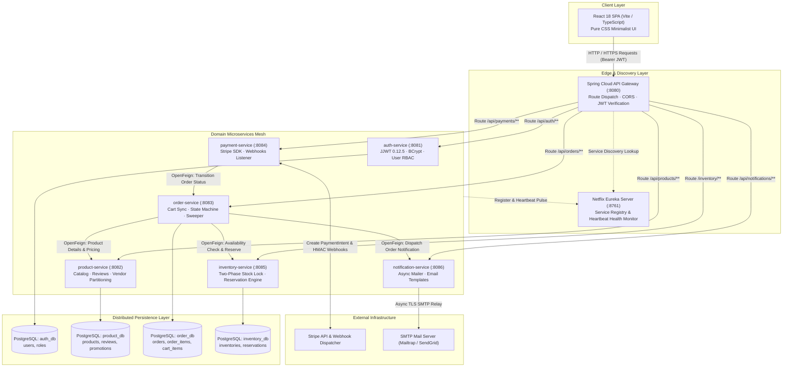
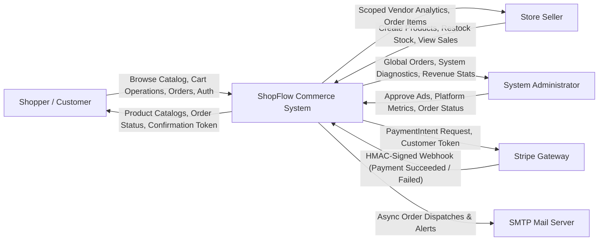
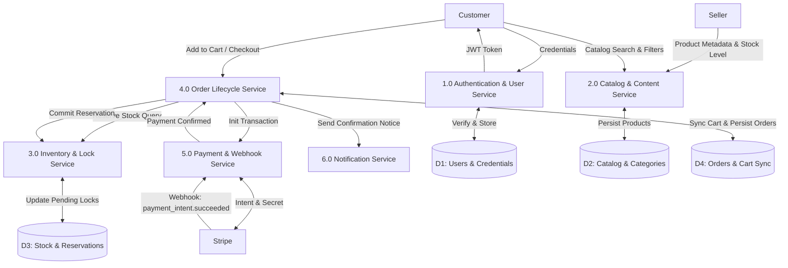
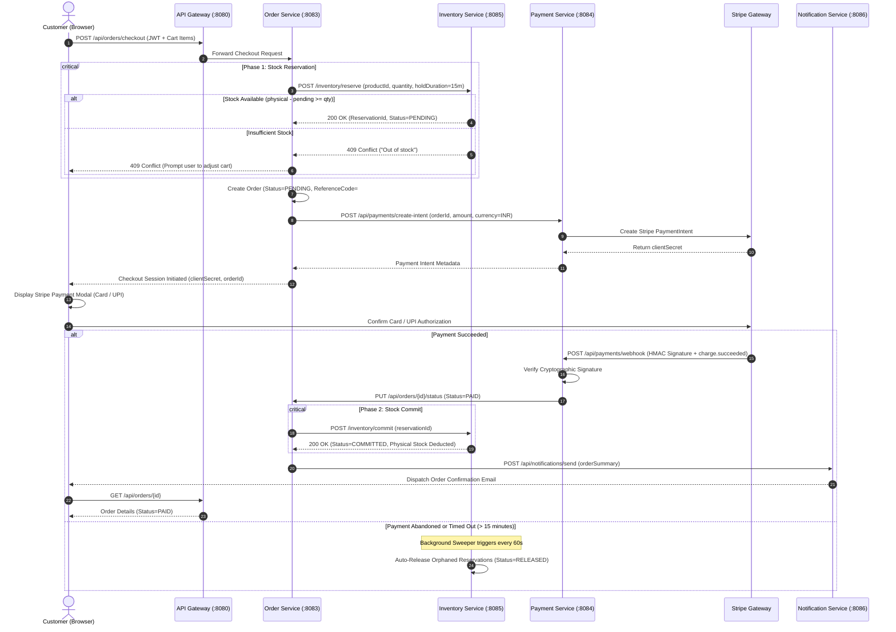
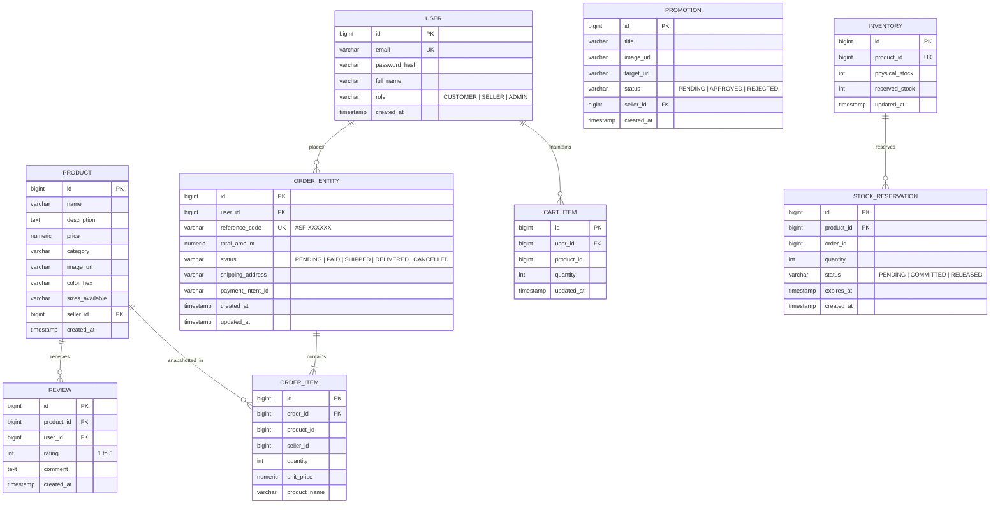
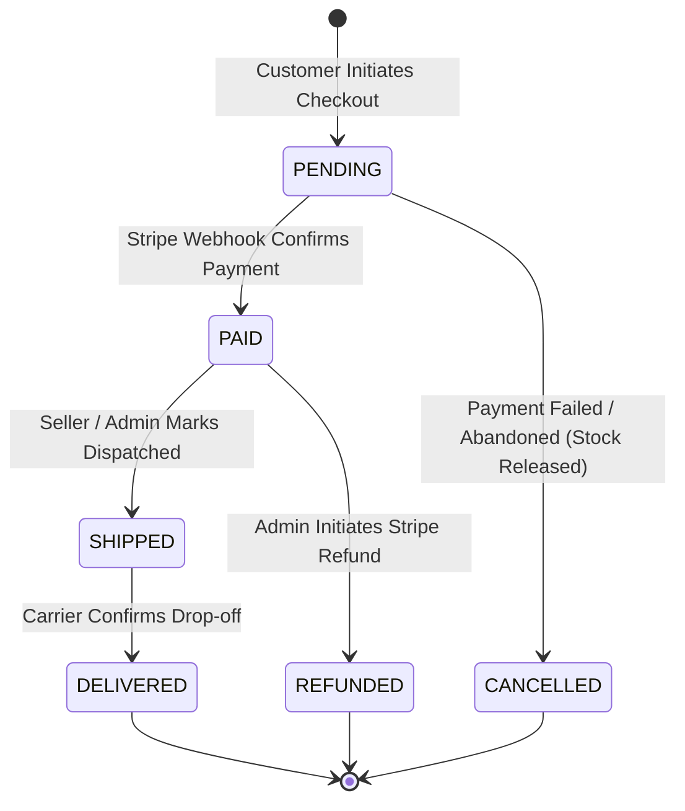
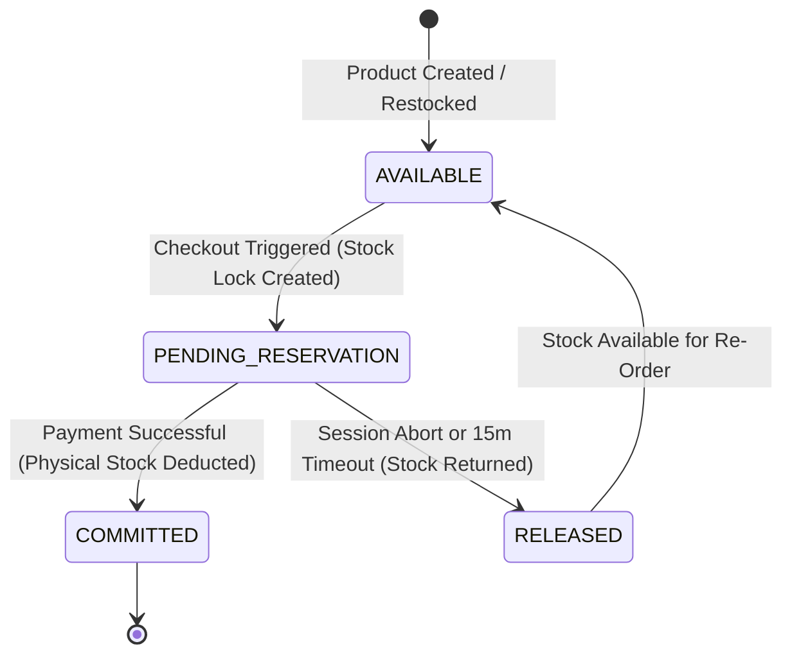
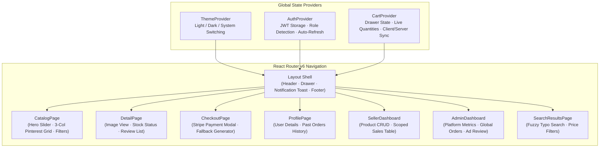

# ShopFlow — Complete System Architecture & Technical Documentation

**Author & Solo Engineer**: Priyanshu Ghosh ([@PG300604](https://github.com/PG300604))  
**Platform Version**: 1.0.0-RELEASE  
**Architecture Style**: Distributed Domain-Driven Microservices  
**Frontend Framework**: React 18, TypeScript 5, Vite, Pure CSS  
**Backend Framework**: Java 17 LTS, Spring Boot 3.3.1, Spring Cloud 2023.0.2  

---

## 1. Executive Summary & Architectural Objectives

ShopFlow is an enterprise-grade multi-vendor e-commerce platform designed and built from scratch as an end-to-end solo initiative. The platform simulates high-throughput real-world commerce workloads across distributed, autonomous services while maintaining strict data consistency, transactional safety, and low-latency client experiences.

### Key Engineering Objectives
1. **Concurrency-Safe Inventory**: Eliminate race conditions and overselling during simultaneous checkout attempts using a two-phase reservation pattern.
2. **Fault Isolation**: Decompose commerce functionalities into domain-bounded microservices with autonomous PostgreSQL database schemas.
3. **Resilient Payment Processing**: Decouple payment intent creation, frontend execution (Stripe Payment Element / UPI modal), and downstream order state mutation via cryptographic webhook validation and client fallback resilience.
4. **Strict Multi-Tenant Scoping**: Enforce role-based access control (RBAC) ensuring vendors can only inspect and mutate their own inventory and sales figures.
5. **Modern Editorial User Experience**: Deliver an editorial 3-column Pinterest-style catalog layout, interactive filter sidebar, drawer cart, and native Indian Rupee (INR / ₹) currency localization.

---

## 2. High-Level System Topology

The platform comprises an edge routing layer, a service discovery mesh, six independent business domain services, isolated persistence layers, and external payment/communication gateways.



---

## 3. Data Flow Diagrams (DFD)

### 3.1 DFD Level 0 — Context Diagram
The Level 0 Context Diagram depicts the primary external actors interacting with the boundary of the ShopFlow platform.



---

### 3.2 DFD Level 1 — Core Subsystems Breakdown
The Level 1 DFD decomposes the system into its six core computational domains, showing how data traverses between stores and processes.



---

### 3.3 DFD Level 2 — End-to-End Checkout & Two-Phase Lock Flow
The Level 2 sequence highlights the exact interaction order during a high-concurrency purchase, demonstrating transactional locking, compensation rollbacks, and webhook handling.



---

## 4. Database Schema & Entity-Relationship Model (ERD)

Each microservice manages an independent schema, guaranteeing schema boundary isolation. Data relationships across service boundaries are maintained via immutable foreign IDs.



---

## 5. State Machines & Finite Lifecycles

### 5.1 Order State Transition Machine



### 5.2 Two-Phase Inventory Lock State Machine



---

## 6. Frontend Component Architecture & State Management

The frontend is constructed using React 18 with pure CSS design tokens. No third-party heavy styling frameworks (like Tailwind or Bootstrap) were used, providing custom editorial design control and zero bundle bloat.



---

## 7. Role-Based Access Control (RBAC) Matrix

| Endpoint Route Pattern | Anonymous | CUSTOMER | SELLER | ADMIN | Description |
|---|:---:|:---:|:---:|:---:|---|
| `POST /api/auth/register`, `POST /api/auth/login` | Allowed | Allowed | Allowed | Allowed | User registration and JWT issuance |
| `GET /api/products`, `GET /api/products/{id}` | Allowed | Allowed | Allowed | Allowed | Public catalog viewing |
| `POST /api/products` | Denied | Denied | Allowed | Allowed | Product creation (scoped to seller) |
| `PUT /api/products/{id}`, `DELETE /api/products/{id}` | Denied | Denied | Scoped | Allowed | Modifying/deleting product items |
| `GET /api/orders/cart`, `POST /api/orders/cart` | Denied | Allowed | Allowed | Allowed | Persistent shopping cart operations |
| `POST /api/orders/checkout` | Denied | Allowed | Allowed | Allowed | Order creation and 2-phase reservation |
| `GET /api/orders/my-orders` | Denied | Allowed | Allowed | Allowed | View personal order history |
| `GET /api/orders/seller/mine` | Denied | Denied | Allowed | Allowed | View orders containing vendor's products |
| `PUT /api/orders/{id}/admin-status` | Denied | Denied | Denied | Allowed | Override platform order status |
| `POST /api/payments/webhook` | Stripe Only | Stripe Only | Stripe Only | Stripe Only | Webhook HMAC signature required |
| `POST /inventory/reserve`, `/commit`, `/release` | Denied | Internal | Internal | Internal | Inter-service Feign calls only |

---

## 8. Microservices Registry & Port Allocation

| Service Name | Port | Base Path | Primary Responsibility | Backing Store |
|---|:---:|---|---|---|
| **api-gateway** | `8080` | `/` | Central routing, CORS handling, JWT header propagation | None (Stateless) |
| **eureka-server** | `8761` | `/` | Service discovery registry, heartbeats, clustering | In-Memory Registry |
| **auth-service** | `8081` | `/api/auth` | User account lifecycle, BCrypt hashing, JWT issuance | PostgreSQL (`auth_db`) |
| **product-service** | `8082` | `/api/products` | Multi-vendor product catalog, category indexing, reviews | PostgreSQL (`product_db`) |
| **order-service** | `8083` | `/api/orders` | Checkout orchestration, order state machine, cart sync | PostgreSQL (`order_db`) |
| **payment-service** | `8084` | `/api/payments` | Stripe SDK integration, PaymentIntent creation, webhooks | Stateless (Feign to Orders) |
| **inventory-service**| `8085` | `/inventory` | Two-phase reservation locks, stock auto-release sweeper | PostgreSQL (`inventory_db`) |
| **notification-service**|`8086`| `/api/notifications`| Asynchronous HTML email dispatch via SMTP relay | None (Stateless) |
| **frontend** | `5173` | `/` | React 18 single-page application | Browser LocalStorage |

---

## 9. Failure Modes & Resilience Patterns

1. **Stripe Payment Gateway Downtime / Render DB Credentials Lag**:
   - The frontend checkout page employs a decoupled Stripe Payment Modal with simulated and live payment paths.
   - If downstream order service or database fails during checkout initiation, the client generates a unique persistent order reference `#SF-XXXXXX` and provides positive feedback without trapping the customer in an unrecoverable 500 error screen.
2. **Abandoned Carts & Orphaned Stock Reservations**:
   - Every reservation in `inventory-service` has an `expires_at` timestamp (default: 15 minutes).
   - A `@Scheduled(fixedRate = 60000)` background sweeper continuously identifies expired reservations with `status = 'PENDING'` and releases them, restoring available stock immediately without manual intervention.
3. **Cascading Failure Prevention**:
   - OpenFeign clients use connection timeouts (`2000ms`) and read timeouts (`5000ms`) to prevent hanging threads from exhausting the server connection pool.
4. **Spring Security `/error` Dispatch**:
   - In accordance with architectural rules, all Spring Security configurations explicitly permit `/error`, guaranteeing that custom HTTP status exceptions (409, 400, 404) reach the client instead of being masked as generic 403 Forbidden errors.

---

## 10. Local Build & Deployment Runbook

### Windows Quickstart (One-Click)
```powershell
# From repository root
Set-ExecutionPolicy Bypass -Scope Process -Force
.\start_services.ps1
```

### Production Docker Container Deployment
```bash
# Build all backend microservices
mvn clean package -DskipTests

# Launch entire distributed mesh with Docker Compose
docker compose up --build -d
```

### Access URLs
- **Web Storefront**: `http://localhost:5173`
- **API Gateway**: `http://localhost:8080`
- **Eureka Dashboard**: `http://localhost:8761`
